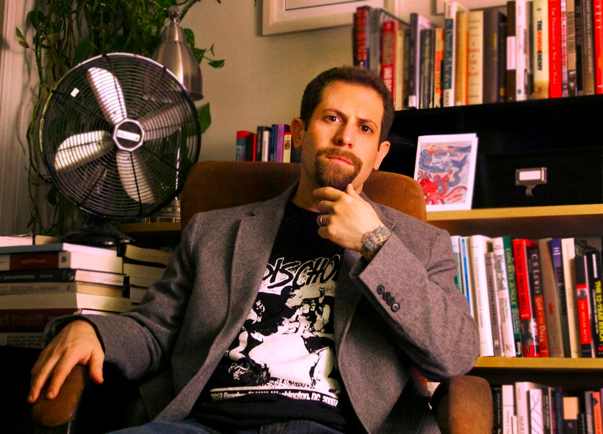
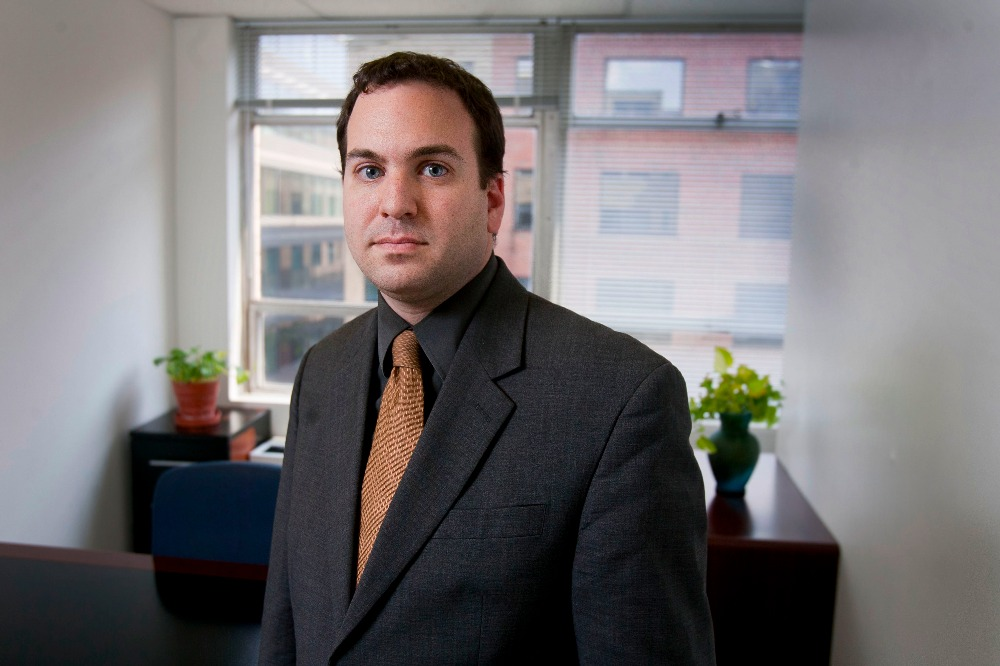

# About Us

#### Operation 45: Transparency and Accountability for the Administration of Donald J. Trump, the 45th President of the United States.

Described by The Nation as "[a ray of hope in these dark political times](https://www.thenation.com/article/your-guide-to-the-sprawling-new-anti-trump-resistance-movement/)", Operation 45 is a 501(c)(3) charitable organization founded by "[transparency luminaries](https://www.gofundme.com/operation-45)" [Ryan Shapiro](https://twitter.com/_rshapiro) (MIT/Harvard) and [Jeffrey Light](https://twitter.com/_lightlaw). Our mission is the aggressive pursuit of governmental transparency in the service of democracy. Most immediately, Operation 45 is dedicated to ensuring transparency and accountability for the Trump/Pence administration.

Given Trump’s authoritarian aspirations and overt contempt for the Constitution, a free press, and civil liberties, the foundational institutions of American democracy now face a profoundly clear and present danger.

The need for transparency has never been greater. Yet the already challenging task of uncovering what our government is really up to is getting even harder.

Fortunately, liberating government documents against powerful opposition is what we do.  Our work obtaining and analyzing documents has provided vital information to journalists at media outlets including the New York Times, The Washington Post, The Wall Street Journal, USA Today, US News & World Report, The Associated Press, NPR, BBC, The Guardian, The Nation, Mother Jones, Democracy Now!, WIRED, Motherboard, Vice News, and numerous others.

*We exposed* the FBI’s earliest known use of classified [remote installation anti-encryption malware](http://www.nytimes.com/2016/04/14/technology/fbi-tried-to-defeat-encryption-10-years-ago-files-show.html?smid=tw-nytimes&smtyp=cur&_r=0), the FBI’s anti-communist crusade against [Nelson Mandela](http://www.usnews.com/news/articles/2014/07/10/the-fbi-spied-on-nelson-mandela-in-1990-as-communist-threat) and the anti-apartheid movement, the inner workings of the [CIA’s spying](https://news.vice.com/article/the-google-search-that-made-the-cia-spy-on-the-us-senate) on the Senate’s investigation of CIA torture, FBI efforts to secure federal [terrorism charges](https://ccrjustice.org/files/11.12.29_Greenscare_VideotapersTerrorists_LATimes.pdf) against animal rights activists who expose horrific conditions on factory farms, FBI policies to conceal information about [electronic surveillance](http://www.usatoday.com/story/news/2016/04/20/fbi-memos-surveillance-secrecy/83280968/) from prosecutors and defendants alike, [unlawful collusion](http://bigstory.ap.org/article/a0a7a3fb1f6449f992f2410c577d919b/apnewsbreak-egg-group-scrambled-over-eggless-mayo-maker) between the USDA’s American Egg Board and a major agricultural lobby, FBI investigative interest in journalist [Michael Hastings](http://america.aljazeera.com/articles/2013/9/9/fbi-releases-redacteddocumentonmichaelhastings.html) (despite FBI protestations to the contrary), details about the sniper plot against Occupy Houston, and the mechanics and architecture of the FBI, DOJ, CIA, and other agencies’ [routine](https://www.theguardian.com/us-news/2016/jan/30/judge-rules-fbi-unlawfully-refused-answer-foia-requests) [and](http://www.motherjones.com/politics/2013/11/foia-ryan-shapiro-fbi-files-lawsuit) [flagrant](https://www.theguardian.com/politics/2016/jul/16/justice-department-freedom-of-information-computer-system) [noncompliance](http://www.huffingtonpost.com/2013/11/14/fbi-foia_n_4270021.html) [with](https://shadowproof.com/2016/02/03/court-decision-stops-fbi-from-eviscerating-freedom-of-information-act/) [the](http://www.metro.us/news/this-mit-scholar-is-taking-on-the-cia/tmWniq---77N09bYMZJHTI/) [Freedom](https://newrepublic.com/article/133871/big-food-doesnt-want-know) [of](http://radioboston.legacy.wbur.org/2013/11/21/the-man-who-foiad-too-much) [Information](http://radioboston.legacy.wbur.org/2013/11/21/the-man-who-foiad-too-much) [Act](http://radioboston.legacy.wbur.org/2013/11/21/the-man-who-foiad-too-much).

# Who We Are

## Ryan Shapiro

**President [Ryan Shapiro](https://twitter.com/_rshapiro)** is a Ph.D. candidate in the Department of Science, Technology, and Society (HASTS) at the Massachusetts Institute of Technology, as well as a Research Affiliate at the Berkman Klein Center for Internet & Society at Harvard University. Shapiro is an historian of national security, the policing of dissent, and governmental transparency. Shapiro is widely known as a leading expert on the Freedom of Information Act (FOIA).

*Politico* describes Shapiro as "a [FOIA guru](http://www.politico.com/tipsheets/morning-agriculture/2016/08/hampton-creek-just-mayo-scandal-spreads-a-well-worn-path-for-gmo-labeling-enforcement-cattlemen-test-esa-voluntary-conservation-push-215731) at the Massachusetts Institute of Technology." The open government website MuckRock describes Shapiro as "a [FOIA superhero](https://www.muckrock.com/news/archives/2013/dec/20/requesters-voice-ryan-shapiro-street-fighting-fbi-/)." Marsh Professor of Journalism at Michigan University and TED Senior Fellow Will Potter describes Shapiro as "[The FBI’s Worst Nightmare](http://www.greenisthenewred.com/blog/ryan-shapiro-fbi-lawsuit/7365/)." Indeed, the FBI itself declares Shapiro’s dissertation FOIA research methodologies themselves to be a threat to national security. Shapiro thanks the Bureau for this compliment.

## Jeffrey Light

**Legal Director [Jeffrey Light](https://twitter.com/_lightlaw)** is a Washington, D.C.-based FOIA specialist attorney. Light is an NLG member who received his JD from Georgetown Law, as well as an MS in Bioinformatics from Brandeis University. Beyond his expertise in FOIA matters, Light also has extensive experience in activist defense and First Amendment law, as well as police misconduct, prisoner abuse, LGBT, and civil rights law. Light is widely regarded as among the best FOIA attorneys in the country.

For his legal work, Light has received awards from the Bill of Rights Defense Committee and the Washington Peace Center.

#### Democracy cannot meaningfully function without an informed citizenry, and such a citizenry is impossible without broad public access to information about the operations of government. If our government is to be accountable to the people, Donald Trump must not be allowed to conduct his presidency from the shadows. Help us shine the light.

*We are a 501(c)(3) non-profit charitable organization dedicated to governmental transparency in the service of democracy. Our tax ID number is 81-4440045. Your gift is tax-deductible to the full extent provided by law.*
